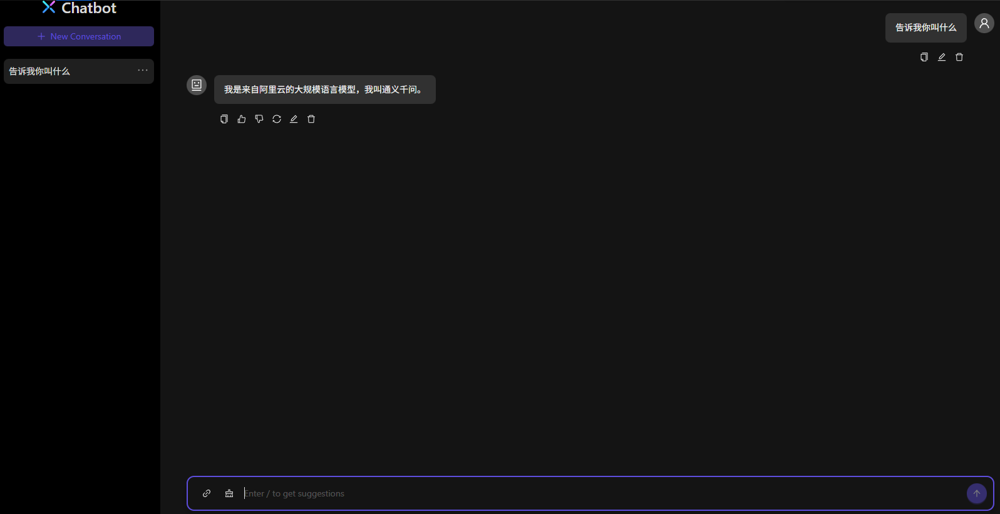

## 1. chatbot-gradio-ui

来源：[modelscope-gradio](https://huggingface.co/spaces/modelscope/modelscope-studio)

效果：




## 2. gradio-docs

from: [How to Create a Chatbot with Gradio](https://www.gradio.app/main/guides/creating-a-chatbot-fast)

## 3. QA with AI

Q：

如果我启动一个gradio服务，chatbot只是一部分，而且chatbot的聊天回复内容是通过我的fastapi获取的，并且是流式返回

A：

明白了！你的情况是将 Gradio 作为前端界面的一部分嵌入到一个更大的应用中，或者你只是想利用 Gradio 的 `ChatInterface` 组件，但其背后的逻辑（特别是 ChatBot 的回复）是由一个独立的 FastAPI 后端服务提供的，并且该服务支持流式（Streaming）响应。

这是一个非常典型的前后端分离架构，Gradio 作为 UI 层，FastAPI 作为数据/逻辑层。实现流式响应的关键在于让你 Gradio 的处理函数能够异步地从 FastAPI 获取数据并逐块返回。

以下是实现这一目标的基本思路和示例：

### 基本思路

1.  **Gradio 处理函数:** `ChatInterface` 的 `fn` 参数需要一个处理函数。这个函数接收用户输入和历史记录。
2.  **调用 FastAPI:** 在这个处理函数内部，你需要发起一个 HTTP 请求（GET 或 POST）到你的 FastAPI 服务。
3.  **处理流式响应:** 你的 FastAPI 服务应该配置为返回 `StreamingResponse` 或类似的流式格式（如 Server-Sent Events - SSE 或简单的文本流）。你需要在 Gradio 的处理函数中正确地处理这个流式响应。
4.  **逐块返回 (Yield):** 使用 `yield` 关键字将从 FastAPI 接收到的数据块逐个返回给 Gradio 的 `ChatInterface`，这样就能实现流式的视觉效果。

### 示例代码

假设你的 FastAPI 服务运行在 `http://localhost:8000/chat`，并且它接受一个 JSON 请求体 `{"message": "...", "history": [...]}` 并返回一个纯文本流。

**1. FastAPI 服务示例 (假设你已经有了):**

```python
# fastapi_app.py (或你的 FastAPI 服务文件)
from fastapi import FastAPI, Request
from fastapi.responses import StreamingResponse
import json
import asyncio # 用于模拟流式延迟

app = FastAPI()

@app.post("/chat")
async def chat_endpoint(request: Request):
    data = await request.json()
    user_message = data.get("message", "")
    history = data.get("history", [])

    async def event_generator():
        # 模拟流式生成回复
        reply_parts = ["Hello", ", ", "this ", "is ", "a ", "streaming ", "response ", "to ", f"'{user_message}'.", "\n", "Streaming ", "completed."]
        for part in reply_parts:
            yield part.encode('utf-8') # 需要编码为 bytes
            await asyncio.sleep(0.5) # 模拟处理延迟

    return StreamingResponse(event_generator(), media_type="text/plain")

if __name__ == "__main__":
    import uvicorn
    uvicorn.run(app, host="localhost", port=8000)
```

**2. Gradio 前端代码 (连接到 FastAPI):**

```python
# gradio_app.py
import gradio as gr
import httpx # 推荐使用 httpx 进行异步请求，支持流式读取
import asyncio # 如果需要异步处理

FASTAPI_URL = "http://localhost:8000/chat"

async def slow_echo_from_fastapi(user_message, history):
    """
    异步处理函数，调用 FastAPI 服务并流式返回结果
    """
    # 准备发送给 FastAPI 的数据
    payload = {
        "message": user_message,
        "history": history
    }

    try:
        # 使用 httpx.AsyncClient 发起异步流式请求
        async with httpx.AsyncClient(timeout=30.0) as client: # 设置合适的超时时间
            async with client.stream("POST", FASTAPI_URL, json=payload) as response:
                response.raise_for_status() # 检查 HTTP 状态码，非 2xx 会抛出异常

                accumulated_response = ""
                # 逐块读取 FastAPI 返回的流式数据
                async for chunk in response.aiter_text(): # 或者 response.aiter_bytes() 如果 FastAPI 返回 bytes
                    if chunk: # 确保 chunk 不为空
                        accumulated_response += chunk
                        # 逐块 yield，Gradio 会实时更新 UI
                        yield accumulated_response
    except httpx.RequestError as e:
        # 处理网络请求错误
        error_msg = f"Error connecting to backend: {e}"
        print(error_msg) # 打印到控制台
        yield error_msg # 也可以选择显示给用户
    except httpx.HTTPStatusError as e:
        # 处理 HTTP 错误状态码
        error_msg = f"Backend returned an error: {e.response.status_code}, {e.response.text}"
        print(error_msg)
        yield error_msg


# --- Gradio UI Setup ---
with gr.Blocks() as demo:
    chatbot = gr.Chatbot(
        label="My Streaming Chatbot",
        bubble_full_width=False,
        avatar_images=("path/to/user_avatar.png", "path/to/bot_avatar.png") # 可选
    )
    msg = gr.Textbox(label="Type your message here...")
    clear = gr.Button("Clear History")

    # 定义提交行为
    def respond(message, chat_history):
        bot_message = slow_echo_from_fastapi(message, chat_history)
        chat_history.append((message, ""))
        # 注意：这里需要 yield 更新 chat_history 和 bot_message
        # 我们需要一个中间函数来协调这两个输出
        full_response = ""
        for partial_resp in bot_message:
             full_response = partial_resp # 更新完整响应
             chat_history[-1] = (message, full_response) # 更新最后一条消息的 bot 回复
             yield chat_history, "" # 返回更新后的历史和清空输入框

    msg.submit(respond, [msg, chatbot], [chatbot, msg]).then(None, None, None, _js=r"""
    () => {
        // 可选：滚动到底部的 JS 代码
        const message_boxes = document.querySelectorAll('.message-wrap');
        if (message_boxes.length > 0) {
            message_boxes[message_boxes.length - 1].scrollIntoView({ behavior: 'smooth', block: 'end' });
        }
    }
    """)

    clear.click(lambda: None, None, chatbot, queue=False)


# 启动 Gradio 应用
if __name__ == "__main__":
    demo.launch(server_name="127.0.0.1", server_port=7860, inbrowser=True, debug=True)
```

### 关键点解释:

1.  **`httpx.AsyncClient` 和 `stream`**: `httpx` 库是现代 Python 中进行 HTTP 请求的推荐库，它对异步和流式请求支持很好。`client.stream()` 方法用于发起流式请求。
2.  **`async` / `await`**: Gradio 支持异步处理函数。使用 `async def` 定义处理函数，并在其中使用 `await` 等待异步操作（如 `httpx` 请求）。
3.  **`response.aiter_text()`**: 这个方法用于异步地逐块迭代响应体的文本内容。如果 FastAPI 返回的是原始字节，则使用 `aiter_bytes()`。
4.  **`yield`**: 在循环中每次接收到新的数据块时，使用 `yield` 将当前累积的完整响应返回。Gradio 会捕捉到这个 `yield` 并实时更新 UI 上的聊天机器人回复部分。
5.  **`ChatInterface` vs `Blocks`**: `ChatInterface` 相对简单，但定制化能力有限。上面的例子使用了 `Blocks`，因为它提供了更灵活的方式来管理 `chatbot` 组件和 `msg` 输入框之间的交互，尤其是在处理复杂的流式响应时。你可以根据需要调整 UI 结构。
6.  **错误处理**: 包含了 `httpx.RequestError` 和 `httpx.HTTPStatusError` 来处理网络错误和 HTTP 错误状态码。

通过这种方式，你的 Gradio `ChatInterface` (或 `Blocks` 中的 `Chatbot`) 就可以作为 UI 层，实时展示来自 FastAPI 后端的流式回复了。