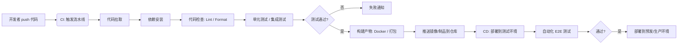

GitHub 上的 **分支（Branch）命名规范** 和 **提交（Commit）信息命名规范** 虽然没有强制标准，但社区和企业中普遍遵循一些最佳实践，以提高协作效率、代码可读性和自动化工具兼容性。以下是常用的规范建议：

---

# 一、分支（Branch）命名规范

### 常见命名模式
1. **功能分支（Feature Branch）**
   - 格式：`feature/<描述>`
   - 示例：`feature/user-login`, `feature/payment-integration`

2. **修复分支（Hotfix / Bugfix Branch）**
   - 格式：
     - 紧急线上修复：`hotfix/<描述>` 或 `hotfix/<issue编号>`
     - 一般 bug 修复：`bugfix/<描述>`
   - 示例：`hotfix/login-error`, `bugfix/typo-in-header`

3. **发布分支（Release Branch）**
   - 格式：`release/<版本号>`
   - 示例：`release/v1.2.0`

4. **开发主干（通常为默认分支）**
   - 常用名称：`main`（推荐）、`master`（旧习惯）

5. **其他用途**
   - 实验性功能：`experiment/<描述>` 或 `spike/<描述>`
   - 个人开发临时分支：`<用户名>/<描述>`（如 `alice/refactor-api`）

### 命名建议
- 使用 **小写字母**
- 使用 **连字符 `-`** 分隔单词（避免下划线 `_` 或空格）
- 避免特殊字符（如 `@#$%`）
- 尽量简短但具有语义
- 可包含 Jira/Ticket/Issue 编号（如 `feature/PROJ-123-add-cart`）

---

# 二、提交（Commit）信息命名规范

最广泛采用的是 **Conventional Commits** 规范（[conventionalcommits.org](https://www.conventionalcommits.org/)），它结构清晰，便于生成 CHANGELOG 和语义化版本（SemVer）。

### 基本格式
```
<type>[optional scope]: <description>

[optional body]

[optional footer(s)]
```

### 常见 type 类型
| 类型 | 说明 |
|------|------|
| `feat` | 新功能（对应 SemVer 的 MINOR 版本） |
| `fix` | 修复 bug（对应 PATCH 版本） |
| `docs` | 文档更新 |
| `style` | 代码格式调整（不影响逻辑，如空格、分号） |
| `refactor` | 重构（既不是新功能也不是修复） |
| `perf` | 性能优化 |
| `test` | 添加或修改测试 |
| `build` | 构建系统或依赖更新 |
| `ci` | CI 配置或脚本变更 |
| `chore` | 杂项（如更新 .gitignore） |

### 示例
```text
feat(auth): add OAuth2 login support

fix(api): resolve null pointer in user endpoint

docs(readme): update installation instructions

refactor(cart): extract checkout logic to service class

chore: bump lodash from 4.17.20 to 4.17.21
```

### 提交信息书写建议
- **首行（标题）**：
  - 不超过 72 个字符
  - 使用祈使句（如 “add”, “fix”, “update” 而非 “added”, “fixed”）
  - 首字母小写
- **正文（Body）**（可选）：
  - 解释 **为什么** 修改，而不是 **做了什么**（代码已体现）
  - 换行空一行后开始
- **页脚（Footer）**（可选）：
  - 关联 Issue（如 `Closes #123` 或 `Fixes PROJ-456`）
  - Breaking Changes（重大变更需标注）

---

# 三、常见 Git 分支模型（策略）

### 1. **Git Flow（经典但稍重）**
- 适合有固定版本发布的项目（如客户端软件）
- 核心分支：
  - `main` / `master`：生产环境代码（打 tag 发布）
  - `develop`：集成开发分支
  - `feature/*`：功能开发
  - `release/*`：发布准备
  - `hotfix/*`：紧急修复

> ⚠️ 缺点：流程复杂，对持续交付（CI/CD）不友好。

---

### 2. **GitHub Flow（轻量、推荐）**
- 适合 Web 应用、SaaS、持续部署场景
- 核心思想：
  - 只有一个长期分支：`main`（或 `production`）
  - 所有开发基于 `main` 拉出 `feature` 或 `bugfix` 分支
  - 通过 **Pull Request（PR）** 合并回 `main`
  - 合并后立即部署（或通过 CI 自动部署）

✅ 简单、高效、与 GitHub/GitLab 深度集成。

---

### 3. **Trunk-Based Development（主干开发）**
- 极限敏捷/DevOps 实践
- 开发者直接在 `main` 上小步快跑，或使用短生命周期分支（<1天）
- 依赖 **特性开关（Feature Flags）** 控制功能可见性
- 需要强大的自动化测试和 CI/CD 支撑

> 大厂如 Google、Netflix 常用。

---

# 四、Git Flow 分支模型与工作流程

Git Flow 是由 Vincent Driessen 在 2010 年提出的一种**结构化 Git 分支模型**，适用于有明确版本发布节奏的项目（如客户端软件、嵌入式系统、传统企业应用等）。虽然在持续交付（CI/CD）盛行的今天略显“重型”，但在需要严格版本控制和并行开发多个版本的场景中依然非常实用。

---

## 一、Git Flow 的核心分支

Git Flow 定义了两类长期存在的主干分支和三类短期辅助分支：

### 🟢 长期分支（永远存在）
| 分支 | 作用 | 稳定性 |
|------|------|--------|
| `main`（或 `master`） | **生产环境代码**，每个提交对应一个正式发布版本（通常打 Git tag） | ✅ 最稳定 |
| `develop` | **集成开发分支**，包含最新开发成果，用于每日构建或测试环境 | 🔧 较稳定 |

### 🟡 短期分支（按需创建，用完即删）
| 分支类型 | 命名规范 | 来源 | 合并目标 | 用途 |
|----------|--------|------|----------|------|
| **Feature** | `feature/*` | `develop` | `develop` | 开发新功能 |
| **Release** | `release/*` | `develop` | `develop` + `main` | 发布准备（修复 bug、更新文档、打版本号） |
|- **Hotfix** | `hotfix/*` | `main` | `main` + `develop` | 紧急修复线上问题 |

---

## 二、完整 Git Flow 工作流程

### 1️⃣ 初始化
```bash
git init
git checkout -b main      # 创建 main 分支（初始提交）
git checkout -b develop   # 从 main 拉出 develop
```

> 实际项目中通常使用 [`git-flow`](https://github.com/nvie/gitflow) 工具初始化：
> ```bash
> git flow init
> ```

---

### 2️⃣ 开发新功能（Feature Branch）

```bash
# 从 develop 拉出 feature 分支
git checkout develop
git checkout -b feature/user-login

# 开发、提交
git add .
git commit -m "feat(auth): implement login form"

# 完成后合并回 develop
git checkout develop
git merge --no-ff feature/user-login
git branch -d feature/user-login
```

> ✅ 使用 `--no-ff` 保留分支合并历史（可视化清晰）

---

### 3️⃣ 准备发布（Release Branch）

当 `develop` 足够稳定，准备发布 v1.2.0：

```bash
# 从 develop 拉出 release 分支
git checkout develop
git checkout -b release/v1.2.0

# 在 release 分支上：
# - 修复发布前发现的 bug
# - 更新版本号（如 package.json、CHANGELOG）
# - 更新文档
git commit -a -m "chore(release): bump version to 1.2.0"
```

#### 发布完成：合并到 main 和 develop

```bash
# 合并到 main（打标签）
git checkout main
git merge --no-ff release/v1.2.0
git tag -a v1.2.0 -m "Release version 1.2.0"

# 合并回 develop（包含 release 期间的修复）
git checkout develop
git merge --no-ff release/v1.2.0

# 删除 release 分支
git branch -d release/v1.2.0
```

> 🔖 **tag 是关键**：`main` 上的每个 tag 对应一个可发布的版本。

---

### 4️⃣ 紧急修复（Hotfix Branch）

线上发现严重 bug，需立即修复：

```bash
# 从 main 拉出 hotfix（基于最新生产版本）
git checkout main
git checkout -b hotfix/login-bug

# 修复并提交
git commit -am "fix(auth): prevent null pointer on login"

# 合并到 main（并打补丁标签）
git checkout main
git merge --no-ff hotfix/login-bug
git tag -a v1.2.1 -m "Hotfix for login bug"

# 同步修复到 develop（避免下次发布又出现）
git checkout develop
git merge --no-ff hotfix/login-bug

# 删除 hotfix 分支
git branch -d hotfix/login-bug
```

---

## 三、Git Flow 分支关系图（简化版）

```
main     ──●───────────────●───────────────●──→ (v1.0, v1.1, v1.2)
           │               │               │
           │               │               └─ hotfix → merge to main & develop
           │               │
develop ───┼───●────●──────●────●──────────●──→
               │    │      │    │
               │    │      │    └─ release → merge to main & develop
               │    │      │
               │    │      └─ feature merged
               │    │
               │    └─ feature branch
               │
               └─ feature branch
```

---

## 四、优缺点分析

### ✅ 优点
- 版本管理清晰，适合**多版本并行维护**
- `release` 分支隔离发布风险
- `hotfix` 快速响应线上问题
- 历史可追溯性强（配合 tag）

### ❌ 缺点
- 流程复杂，学习成本高
- 不适合**持续部署**（CD）场景
- `develop` 与 `main` 可能长期不一致
- 小团队或 Web 应用可能“杀鸡用牛刀”

> 💡 **现代替代方案**：GitHub Flow / Trunk-Based Development + Feature Flags

---

## 五、工具支持

### 1. **官方 `git-flow` CLI 工具**
安装（macOS）：
```bash
brew install git-flow
```

常用命令：
```bash
git flow init                     # 初始化
git flow feature start login      # 创建 feature
git flow feature finish login     # 完成并合并到 develop
git flow release start 1.2.0
git flow release finish 1.2.0
git flow hotfix start critical-bug
git flow hotfix finish critical-bug
```

> ⚠️ 注意：该工具已多年未活跃维护，但逻辑仍有效。

### 2. **Git Extensions / Sourcetree**
图形化工具内置 Git Flow 支持。

---

## 六、何时使用 Git Flow？

✅ 推荐使用场景：
- 有固定发布周期（如每月发版）
- 需要同时维护多个历史版本（如 v1.x, v2.x）
- 产品型软件（非 Web SaaS）
- 团队熟悉该模型且流程已固化

❌ 不推荐场景：
- 每天多次部署的 Web 应用
- 微服务架构（每个服务独立发布）
- 小型敏捷团队追求快速迭代

---

## 七、总结：Git Flow 核心规则

| 操作 | 来源分支 | 目标分支 | 是否打 tag |
|------|--------|--------|----------|
| 新功能开发 | `develop` → `feature/*` → `develop` | ❌ |
| 发布准备 | `develop` → `release/*` → `main` + `develop` | ✅（在 main 上） |
| 紧急修复 | `main` → `hotfix/*` → `main` + `develop` | ✅（补丁版本） |

> 📌 **黄金法则**：  
> - 所有新功能进 `develop`  
> - 所有发布从 `develop` 切出  
> - 所有 hotfix 从 `main` 切出，并同步回 `develop`

---

如果你正在考虑是否采用 Git Flow，建议评估团队发布频率和维护需求。对于大多数现代 Web 项目，**GitHub Flow + 语义化版本 + 自动化 CI/CD** 可能更高效。但若你维护的是 SDK、桌面软件或嵌入式固件，Git Flow 仍是可靠选择。

# 五、自动化 CI/CD

实现 **自动化 CI/CD（持续集成 / 持续交付或部署）** 是现代软件开发的核心实践，能显著提升交付速度、代码质量和系统稳定性。下面从 **概念、流程设计、工具选型、实施步骤** 到 **最佳实践** 全面讲解如何落地自动化 CI/CD。

---

## 一、CI/CD 核心概念

| 缩写 | 全称 | 目标 |
|------|------|------|
| **CI** | Continuous Integration（持续集成） | 开发者频繁合并代码到主干，每次提交自动构建 & 测试 |
| **CD** | Continuous Delivery（持续交付） | 任何提交都可一键部署到生产环境（需人工触发） |
| **CD** | Continuous Deployment（持续部署） | 所有通过测试的提交**自动部署**到生产环境（无人工干预） |

> ✅ 理想状态：**每次 `git push` → 自动测试 → 自动部署上线**

---

## 二、典型 CI/CD 流程（以 Web 应用为例）



---

## 三、主流 CI/CD 工具选型

| 场景 | 推荐工具 |
|------|--------|
| **GitHub 项目** | GitHub Actions（免费、深度集成）✅ |
| **GitLab 项目** | GitLab CI/CD（内置、强大）✅ |
| **多平台 / 企业级** | Jenkins（灵活但需运维） |
| **云原生 / Kubernetes** | Argo CD（GitOps）、Tekton |
| **轻量 / 快速上手** | CircleCI、Drone CI、Travis CI |
| **微软生态** | Azure Pipelines |

> 💡 对于大多数团队，**GitHub Actions 或 GitLab CI** 是首选（无需自建服务器）。

---

## 四、以 GitHub Actions 为例：实现自动化 CI/CD

### 步骤 1：创建 Workflow 文件
在项目根目录创建：
```
.github/workflows/ci-cd.yml
```

### 步骤 2：编写 YAML 流水线（示例：Node.js + Docker + AWS）

```yaml
name: CI/CD Pipeline

on:
  push:
    branches: [ main ]        # 只在 main 分支 push 时触发 CD
  pull_request:
    branches: [ main ]        # PR 触发 CI（不部署）

jobs:
  # === CI: 测试与构建 ===
  test-and-build:
    runs-on: ubuntu-latest
    steps:
      - uses: actions/checkout@v4

      - name: Setup Node.js
        uses: actions/setup-node@v4
        with:
          node-version: 18

      - name: Install dependencies
        run: npm ci

      - name: Lint
        run: npm run lint

      - name: Run tests
        run: npm test

      - name: Build app
        run: npm run build

      - name: Build and push Docker image
        if: github.ref == 'refs/heads/main'  # 仅 main 分支构建镜像
        run: |
          echo "${{ secrets.AWS_ECR_PASSWORD }}" | docker login \
            --username AWS \
            --password-stdin ${{ secrets.AWS_ECR_REGISTRY }}
          docker build -t my-app:${{ github.sha }} .
          docker tag my-app:${{ github.sha }} ${{ secrets.AWS_ECR_REPO }}:latest
          docker push ${{ secrets.AWS_ECR_REPO }}:latest

  # === CD: 部署到服务器（示例：SSH 部署）===
  deploy:
    needs: test-and-build
    if: github.ref == 'refs/heads/main'
    runs-on: ubuntu-latest
    steps:
      - name: Deploy to EC2
        uses: appleboy/ssh-action@v1
        with:
          host: ${{ secrets.HOST }}
          username: ${{ secrets.USERNAME }}
          key: ${{ secrets.SSH_KEY }}
          script: |
            docker stop my-app || true
            docker rm my-app || true
            docker rmi ${{ secrets.AWS_ECR_REPO }}:latest || true
            docker pull ${{ secrets.AWS_ECR_REPO }}:latest
            docker run -d --name my-app -p 3000:3000 ${{ secrets.AWS_ECR_REPO }}:latest
```

### 步骤 3：配置 Secrets（敏感信息）
在 GitHub 仓库 → **Settings → Secrets and variables → Actions** 中添加：
- `AWS_ECR_PASSWORD`
- `AWS_ECR_REGISTRY`
- `AWS_ECR_REPO`
- `HOST`, `USERNAME`, `SSH_KEY`（用于部署）

---

## 五、关键自动化环节详解

| 环节 | 工具/技术 | 说明 |
|------|----------|------|
| **代码检查** | ESLint, Prettier, Stylelint | 保证代码风格统一 |
| **单元测试** | Jest, Vitest, Pytest, JUnit | 覆盖核心逻辑 |
| **安全扫描** | Snyk, Trivy, OWASP ZAP | 检测依赖漏洞 |
| **构建产物** | Webpack, Docker, Maven | 生成可部署包 |
| **制品仓库** | Docker Hub, AWS ECR, Nexus | 存储构建结果 |
| **部署方式** | SSH, Kubernetes (kubectl), Terraform, Ansible | 将应用上线 |
| **通知** | Slack, Email, Discord | 失败/成功提醒 |

---

## 六、进阶：实现 GitOps（推荐用于生产）

使用 **Argo CD** 或 **Flux CD** 实现声明式部署：

1. 将 Kubernetes 配置文件存入 Git 仓库（如 `deploy/prod/`）
2. Argo CD 监听该仓库
3. 当镜像 tag 更新 → 自动同步到集群

✅ 优势：部署可审计、回滚简单、环境一致性高。

---

## 七、CI/CD 最佳实践

| 实践 | 说明 |
|------|------|
| **主干始终可部署** | `main` 分支任何提交都应能上线 |
| **快速反馈** | CI 流水线应在 5~10 分钟内完成 |
| **测试分层** | 单元测试（快）→ 集成测试 → E2E（慢）|
| **环境隔离** | dev → staging → prod，逐级验证 |
| **不可变发布** | 构建一次，多环境部署（避免“在我机器上能跑”）|
| **回滚机制** | 支持一键回退到上一版本 |
| **监控告警** | 部署后自动验证健康状态（如 HTTP 200）|

---

## 八、常见反模式（Avoid!）

❌ 在 CI 中运行耗时过长的任务（如全量数据迁移）  
❌ 将密码硬编码在 YAML 文件中  
❌ 跳过测试直接部署（“这次很小，不用测”）  
❌ 没有 staging 环境，直接上线到生产  

---
